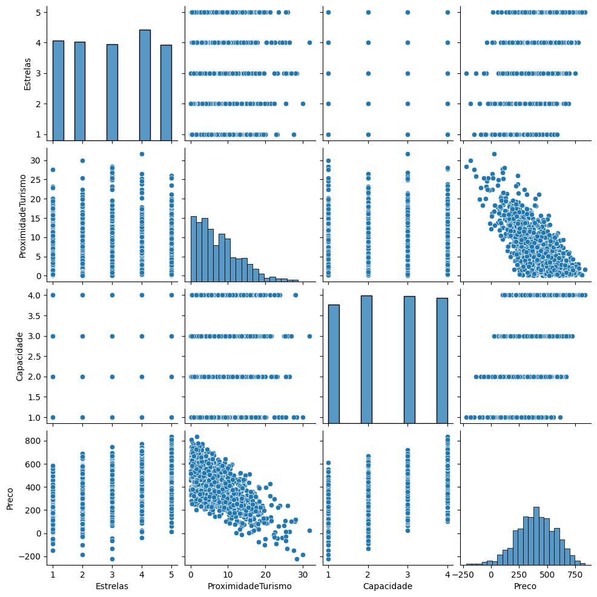

# 🏨 Análise e Seleção de Modelos de Regressão: Precificação de Hotéis

Este repositório contém um projeto de Data Science focado em **Precificação Preditiva**. Utilizando uma base de dados de hotelaria, para explorar diferentes variáveis (Estrelas, Localização e Capacidade) que influenciam o preço das diárias através de modelos de Regressão Linear.

## 📋 Visão Geral do Projeto

O objetivo é construir e comparar modelos estatísticos para entender qual combinação de fatores melhor explica a variação de preços no setor hoteleiro. Este projeto segue as etapas fundamentais de um fluxo de trabalho de ciência de dados:
1.  **Análise Exploratória de Dados (EDA)**
2.  **Tratamento e Preparação**
3.  **Modelagem Estatística (OLS)**
4.  **Comparação de Performance**

Abaixo está o PairPlot gerado para identificar correlações entre as variáveis:


## 📊 Metodologia e Modelos

Foram construídos três modelos crescentes em complexidade para avaliar o ganho de precisão (R²):

* **Modelo 1:** Utiliza apenas a classificação por **Estrelas**.
* **Modelo 2:** Combina **Estrelas** e **Proximidade ao Turismo**.
* **Modelo 3:** Modelo múltiplo completo com **Estrelas**, **Proximidade** e **Capacidade**.

A biblioteca `statsmodels` foi escolhida por fornecer um sumário estatístico detalhado, permitindo analisar não apenas o erro, mas a significância estatística (P-value) de cada variável.

## 🛠️ Tecnologias Utilizadas

* **Python 3.x**
* **Pandas**: Manipulação de dados.
* **Seaborn/Matplotlib**: Visualização de dados.
* **Statsmodels**: Regressão linear e testes estatísticos.

## 🚀 Como Executar

1.  Clone este repositório:
    ```bash
    git clone [https://github.com/seu-usuario/nome-do-repositorio.git](https://github.com/seu-usuario/nome-do-repositorio.git)
    ```
2.  Certifique-se de ter as bibliotecas instaladas:
    ```bash
    pip install pandas seaborn matplotlib statsmodels
    ```
3.  Execute o script ou notebook Python.

## 📝 Código Principal

```python
import pandas as pd
import seaborn as sns
import matplotlib.pyplot as plt
import statsmodels.api as sm

# Carga dos dados
df = pd.read_csv('hoteis.csv')

# Análise Visual
sns.pairplot(df)
plt.show()

# Exemplo de Construção do Modelo Múltiplo (Modelo 3)
X = df[['Estrelas', 'ProximidadeTurismo', 'Capacidade']]
X = sm.add_constant(X)
y = df['Preco']
modelo_3 = sm.OLS(y, X).fit()

print(modelo_3.summary())
```

## 📈 Conclusões
Através da comparação dos modelos, é possível observar:
1.  **R-squared: O quanto cada modelo se aproxima da realidade.**
2.  **Coeficientes: O impacto financeiro real de cada estrela adicional ou quilômetro de distância no preço final.**
3.  **P-values: Quais variáveis são realmente relevantes para o negócio.**

Desenvolvido por **Diego Alves** - Estudo de Regressão Linear para Precificação.
